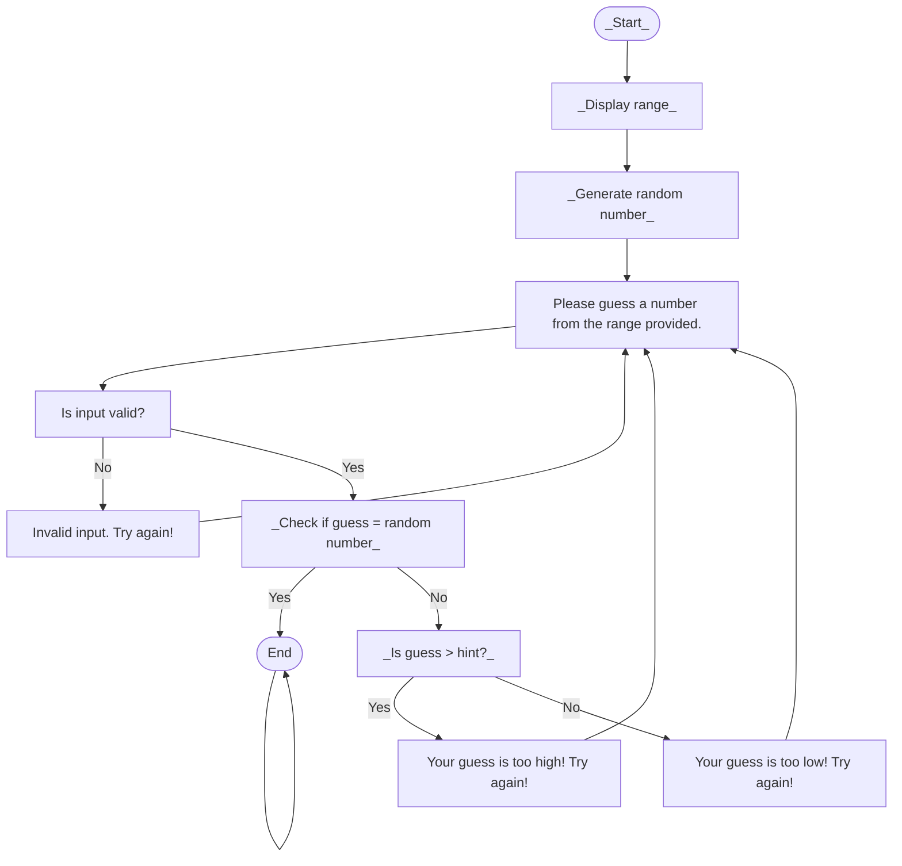

```mermaid
flowchart TD
Start([_Start_]) --> Range[_Display range_]
Range --> Rand[_Generate random number_]
Rand --> Input["Please guess a number from the range provided."]
Input --> Valid[Is input valid?]
Valid --> |No| Error["Invalid input. Try again!"] --> Input
Valid --> |Yes| Check[_Check if guess = random number_]
Check --> |Yes| End["You got it right! Congratulations!"] --> End([End])
Check --> |No| Hint[_Is guess > hint?_]
Hint --> |Yes| High["Your guess is too high! Try again!"] --> Input
Hint --> |No| Low["Your guess is too low! Try again!"] --> Input
```