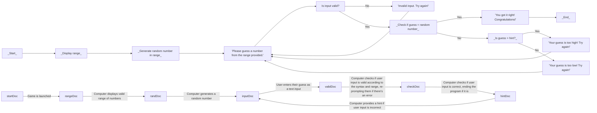

```mermaid
flowchart LR
_Start_ --> Range[_Display range_]
Range --> Rand[_Generate random number in range_]
Rand --> Input['Please guess a number from the range provided.']
Input --> Valid[Is input valid?]
Valid --> |No| Error['Invalid input. Try again!'] --> Input
Valid --> |Yes| Check[_Check if guess = random number_]
Check --> |Yes| End['You got it right! Congratulations!'] --> _End_
Check --> |No| Hint[_Is guess > hint?_]
Hint --> |Yes| High['Your guess is too high! Try again!'] --> Input
Hint --> |No| Low['Your guess is too low! Try again!'] --> Input

%% startDoc --> rangeDoc --> randDoc --> inputDoc --> validDoc --> checkDoc --> hintDoc
startDoc -- Game is launched --> rangeDoc -- Computer displays valid range of numbers --> randDoc -- Computer generates a random number --> inputDoc -- User enters their guess as a text input --> validDoc -- Computer checks if user input is valid according to the syntax and range, re-prompting them if there's an error --> checkDoc -- Computer checks if user input is correct, ending the program if it is --> hintDoc -- Computer provides a hint if user input is incorrect --> inputDoc
```