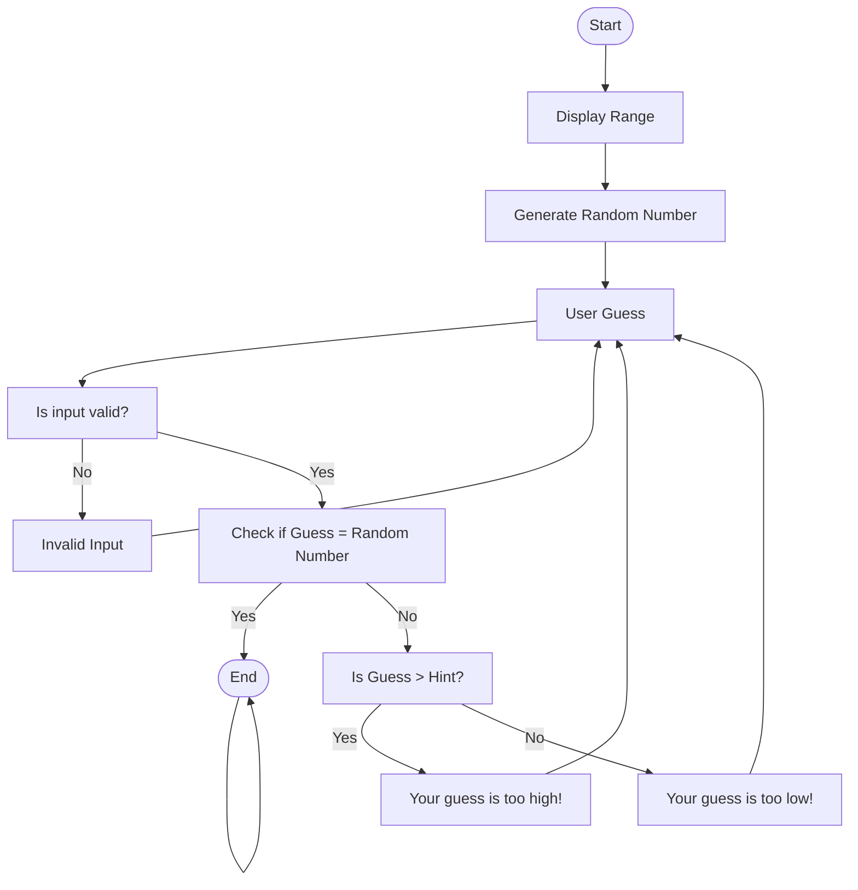

```mermaid
flowchart TD
Start([Start]) --> Range[Display Range]
Range --> Rand[Generate Random Number]
Rand --> Input[User Guess]
Input --> Valid[Is input valid?]
Valid --> |No| Error[Invalid Input] --> Input
Valid --> |Yes| Check[Check if Guess = Random Number]
Check --> |Yes| End[You got it right! Congratulations!] --> End([End])
Check --> |No| Hint[Is Guess > Hint?]
Hint --> |Yes| High[Your guess is too high!] --> Input
Hint --> |No| Low[Your guess is too low!] --> Input
```