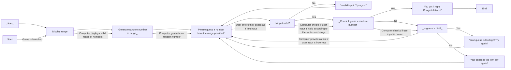

```mermaid
flowchart LR
_Start_ --> Range[_Display range_]
Range --> Rand[_Generate random number in range_]
Rand --> Input['Please guess a number from the range provided.']
Input --> Valid[Is input valid?]
Valid --> |No| Error['Invalid input. Try again!'] --> Input
Valid --> |Yes| Check[_Check if guess = random number_]
Check --> |Yes| End['You got it right! Congratulations!'] --> _End_
Check --> |No| Hint[_Is guess > hint?_]
Hint --> |Yes| High['Your guess is too high! Try again!'] --> Input
Hint --> |No| Low['Your guess is too low! Try again!'] --> Input

%% Start --> Range --> Rand --> Input --> Valid --> Check --> Hint
Start -- Game is launched --> Range -- Computer displays valid range of numbers --> Rand -- Computer generates a random number --> Input -- User enters their guess as a text input --> Valid -- Computer checks if user input is valid according to the syntax and range --> Check -- Computer checks if user input is correct --> Hint -- Computer provides a hint if user input is incorrect --> Input
```