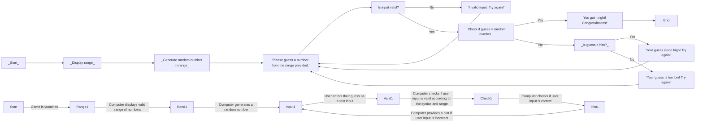

```mermaid
flowchart LR
_Start_ --> Range[_Display range_]
Range --> Rand[_Generate random number in range_]
Rand --> Input['Please guess a number from the range provided.']
Input --> Valid[Is input valid?]
Valid --> |No| Error['Invalid input. Try again!'] --> Input
Valid --> |Yes| Check[_Check if guess = random number_]
Check --> |Yes| End['You got it right! Congratulations!'] --> _End_
Check --> |No| Hint[_Is guess > hint?_]
Hint --> |Yes| High['Your guess is too high! Try again!'] --> Input
Hint --> |No| Low['Your guess is too low! Try again!'] --> Input

%% Start --> Range1 --> Rand1 --> Input1 --> Valid1 --> Check1 --> Hint1
Start -- Game is launched --> Range1 -- Computer displays valid range of numbers --> Rand1 -- Computer generates a random number --> Input1 -- User enters their guess as a text input --> Valid1 -- Computer checks if user input is valid according to the syntax and range --> Check1 -- Computer checks if user input is correct --> Hint1 -- Computer provides a hint if user input is incorrect --> Input1
```